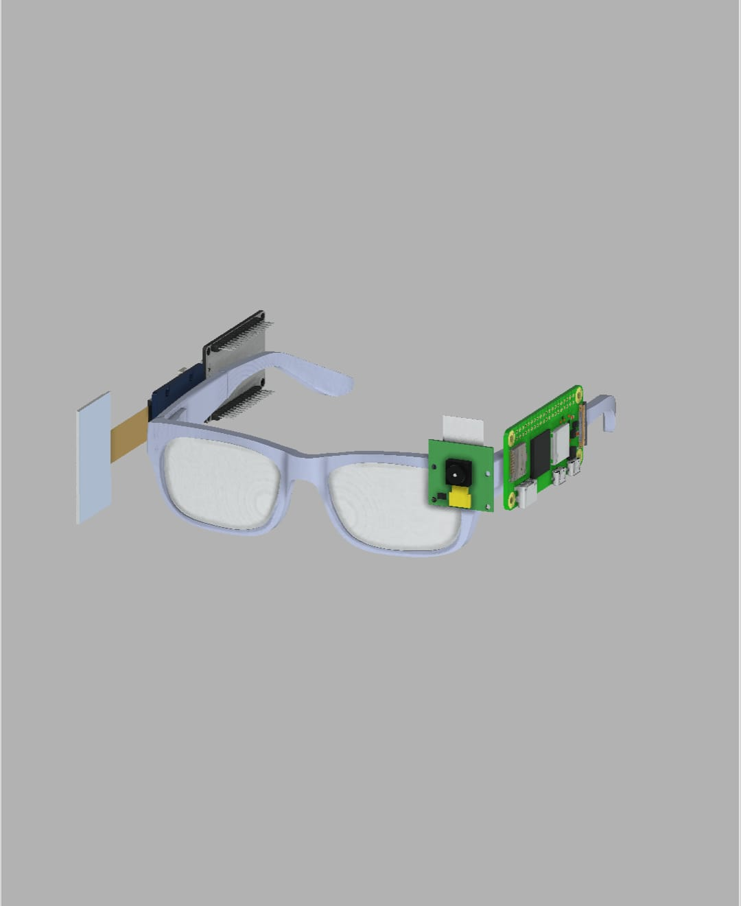
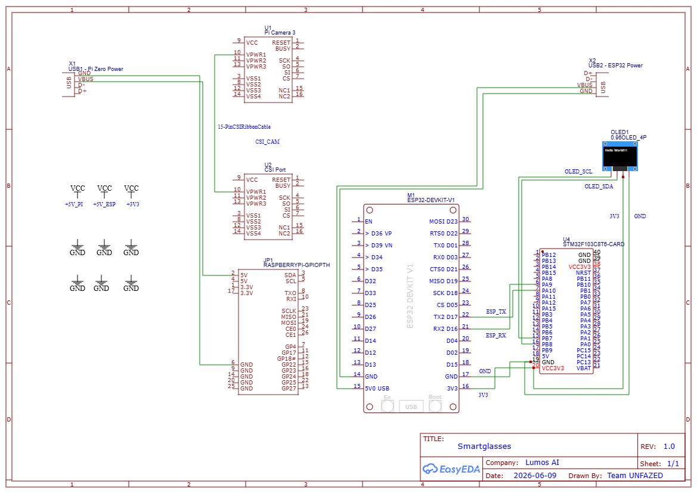
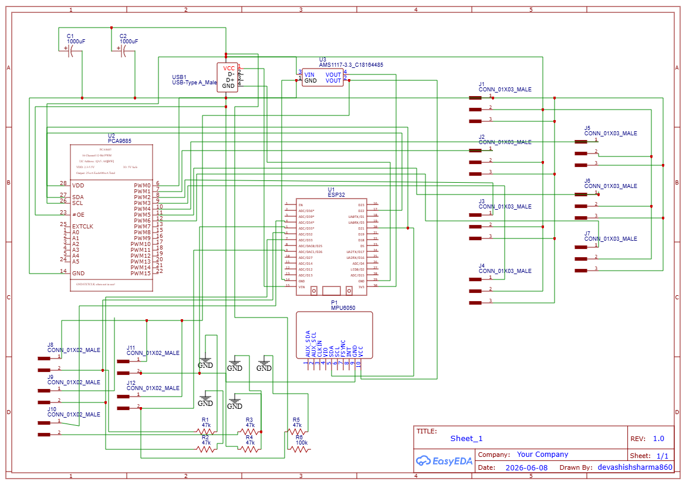

# 🌍 Lumos X ASL Gloves

**Bridging Accessibility Through Artificial Intelligence**

> *"Giving a voice to those who cannot speak, ears to those who cannot hear, and a bridge to those isolated by multiple disabilities."*

Empowering independence for individuals with disabilities through intelligent wearable technology.

---

## 🏆 Recognition

Our Team Unfazed project Lumos AI Glasses won **India's largest GenAI student challenge** at the **OpenAI Academy × NxtWave Buildathon Maharashtra**, receiving a prize of **₹5,00,000** at the India AI Impact Summit 2026.

📄 [Read the full article →](https://etedge-insights.com/trending/openai-academy-x-nxtwave-buildathon-maharashtra-team-wins-indias-largest-genai-student-challenge-at-india-ai-impact-summit-2026/)
---

## The Problem

Millions of people around the world live with visual, hearing, and speech impairments. While assistive technologies exist, most are designed to address only a **single disability**.

- Solutions for the visually impaired assume the user can hear.
- Solutions for the deaf assume the user can see.
- Solutions for speech impairments assume the user can either hear or see.
- Very few technologies support individuals with **multiple disabilities simultaneously**.

This leaves many people dependent on caregivers for everyday communication and interaction.

---

## Our Vision

We believe accessibility should not be fragmented.

Instead of creating isolated solutions, we set out to build an ecosystem of assistive technologies that adapts to the unique needs of different users. This led to two complementary systems:

| System | Designed For |
|---|---|
| **Lumos AI Glasses** | Individuals with a single disability: blindness, deafness, or muteness |
| **ASL Gloves** | Individuals who are blind, deaf, and mute simultaneously |

Together, these systems aim to ensure that no one is left behind.

---

## 👓 Lumos AI Glasses

Lumos is an AI-powered wearable that helps individuals with single disabilities interact with the world more independently. It provides a unified assistive platform — not a narrow, single-purpose tool.

### For Visually Impaired Users
- Real-time object detection using YOLOv8
- Scene understanding and environmental awareness
- Text recognition (OCR) and reading assistance
- Context-aware AI assistance with audio feedback

### For Hearing-Impaired Users
- Speech-to-text transcription
- Live conversation display
- Transparent OLED notifications (Waveshare 1.51")
- Real-time communication support

### For Speech-Impaired Users
- AI-assisted communication support
- Text-based interaction
- Conversation assistance

### Features at a Glance
- Real-time object detection
- OCR and text reading
- Sign language recognition
- Speech-to-text conversion
- Waveshare 1.51" Transparent OLED integration
- AI-powered contextual assistance
- Camera-based environmental understanding
- Custom CAD wearable design
- OpenAI / Gemini powered intelligence

---

## 🤚 ASL Gloves

During research, we discovered an even bigger challenge: individuals who are simultaneously blind, deaf, and mute cannot effectively use most existing assistive technologies — because every tool depends on either sight or hearing.

**ASL Gloves** are intelligent wearable gloves that enable bi-directional communication through touch, reducing dependence on caregivers and interpreters.

### User → World (Sign to Speech)

The user expresses themselves through sign language. The gloves translate it into speech in real time.

```
Sign Language
    ↓
Flex Sensors + MPU6050  (capture hand shape + wrist orientation)
    ↓
ESP32 Processing
    ↓
Gesture Recognition
    ↓
Text Generation
    ↓
Speech Output
```

> **Result:** The user can effectively "speak" using sign language.

### World → User (Speech to Sign)

Others communicate normally through speech. The gloves translate it into finger movements the user can feel.

```
Speech
    ↓
Mobile Application  (MIT App Inventor)
    ↓
Speech-to-Text
    ↓
Bluetooth
    ↓
ESP32 + PCA9685
    ↓
Servo Actuation
    ↓
Finger Movements
    ↓
User Understands Through Touch
```

> **Result:** The user can effectively "hear" conversations through tactile feedback.

### Features at a Glance

**Sign → Speech**
- Flex sensor-based gesture recognition
- MPU6050 wrist orientation tracking
- ESP32 gesture processing
- Real-time speech generation
- Smartphone text output

**Speech → Sign**
- Mobile speech recognition
- Bluetooth communication
- PCA9685 servo control
- Finger actuation using SG90 servos
- Wrist movements using MG90S servos
- Tactile communication

**Additional**
- Bi-directional communication
- Specifically designed for blind, deaf, and mute individuals
- Low-cost architecture (~₹2,580 total)
- Portable wearable design
- Smartphone integration
- Open-source hardware

---

## 🔧 Hardware & Design

### Lumos AI Glasses

<!-- Add Lumos CAD render here -->




### ASL Gloves


---

## 💻 Technology Stack

### Lumos AI Glasses

**Software**
- Python, OpenCV, YOLOv8, ONNX Runtime
- Speech Recognition
- OpenAI APIs, Gemini APIs

**Hardware**
- Raspberry Pi
- Camera Module
- ESP32
- Waveshare 1.51" Transparent OLED

### ASL Gloves

**Software**
- ESP32 Firmware (Arduino Framework)
- MIT App Inventor
- Bluetooth Low Energy

**Hardware**
- ESP32
- PCA9685
- MPU6050
- Flex Sensors
- SG90 Servos, MG90S Servos

---

## 📦 ASL Gloves — Bill of Materials

| Component | Qty | Cost |
|---|---|---|
| ESP32 Dev Module | 1 | ₹350 |
| SG90 Servos | 5 | ₹600 |
| MG90S Servos | 2 | ₹360 |
| Flex Sensors | 5 | ₹750 |
| MPU6050 | 1 | ₹120 |
| Power Bank | 1 | ₹0 |
| USB Breakout | 1 | ₹30 |
| LM2596 | 1 | ₹60 |
| AMS1117 | 1 | ₹20 |
| PCA9685 | 1 | ₹150 |
| 47kΩ Resistors | 5 | ₹20 |
| 1000µF Capacitors | 2 | ₹30 |
| 100Ω Resistor | 1 | ₹10 |
| Fishing Line | 1 roll | ₹80 |
| Glove | 1 | ₹120 |
| Servo Mounts | 1 set | ₹100 |
| Jumper Wires | 1 set | ₹80 |
| USB-C Cable | 1 | ₹50 |
| **Total** | | **₹2,580** |

---

## 🚀 Setup

### Lumos AI Glasses

**Requirements**
- Raspberry Pi
- Camera Module
- ESP32
- Waveshare Transparent OLED

**Installation**

```bash
git clone https://github.com/Pranay096/Lumos-X-ASL-Gloves.git
cd Lumos-X-ASL-Gloves
pip install -r requirements.txt
```

**Run**

```bash
python object_detection.py
python sign_language_detection.py
python speech_to_text.py
```

**ESP32 Setup**

Flash the display firmware using Arduino IDE.

---

### ASL Gloves

**Hardware Assembly**
1. Assemble according to schematic
2. Connect flex sensors
3. Mount servos
4. Wire PCA9685 and MPU6050
5. Connect power distribution

**Firmware**

Install the following Arduino IDE libraries:
- Wire
- Adafruit PWM Servo Driver
- Bluetooth Libraries
- MPU6050 Libraries

Then upload the ESP32 firmware.

**Mobile App**
1. Build the MIT App Inventor APK
2. Pair smartphone with ESP32
3. Start communication

---

## 🎬 Demonstrations

### Lumos AI Glasses

**Status: ✅ Fully Complete and Fully Functional**

Lumos has been fully developed and validated as a working prototype.

📽️ **Demo Video:** <!-- Add link here -->

---

### ASL Gloves

**Status: 🚧 Development in Progress**

**Completed:**
- [x] Circuit design
- [x] PCB design
- [x] Wiring completed
- [x] ESP32 firmware completed
- [x] Sign-to-Speech completed
- [x] Speech-to-Sign completed
- [x] Mobile application completed

**Remaining:**
- [ ] Final assembly onto wearable gloves
- [ ] Integration testing

Final wearable implementation will be completed during **Round 2**.

---

## 📈 Path to Impact

This recognition opens doors to mentorship, ecosystem support, and future opportunities that can help transform these prototypes into real-world solutions capable of impacting millions of lives.

> Some advanced blind-assistance capabilities in Lumos currently rely on cloud-based AI (OpenAI and Gemini APIs). Our long-term goal is to evolve Lumos into a market-ready product that is more affordable, scalable, and increasingly independent of cloud dependencies.

Most importantly, it reinforces our belief that **accessibility should not be treated as an afterthought.**

**Lumos** empowers individuals with single disabilities. **ASL Gloves** ensure that even those facing the most severe communication barriers are not left behind.

### 🔭 Roadmap

- Offline AI inference
- Edge deployment of multimodal models
- Support for multiple sign languages
- Personalized gesture calibration
- Emergency SOS integration
- Haptic notifications
- Commercial product miniaturization

---

## 👥 Team

Built by students passionate about using artificial intelligence to create technologies that restore independence, dignity, and human connection.

Because true accessibility means ensuring that **no one is excluded.**

---

## 📄 License

This project is licensed under the [MIT License](LICENSE).
