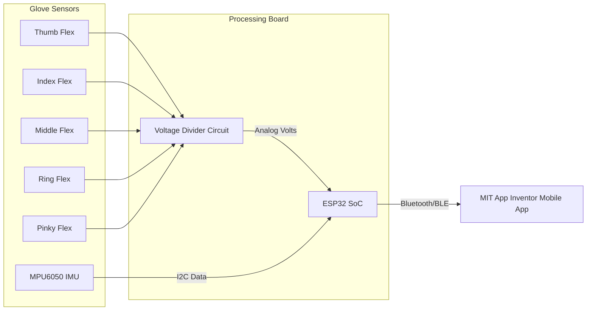

# ASL Glove Architecture

## 1. Hardware Diagram

## 2. Communication Protocol
The glove transmits data packets at 20Hz (every 50ms).
Each packet is sent as a plain-text comma-separated value (CSV) string ended by a newline character (`\n`):
`Thumb,Index,Middle,Ring,Pinky,AccelX,AccelY,AccelZ`

* **Flex sensor values**: Range `0` to `4095` (12-bit ADC).
* **Accelerometer values**: Range `-32768` to `32767`.
